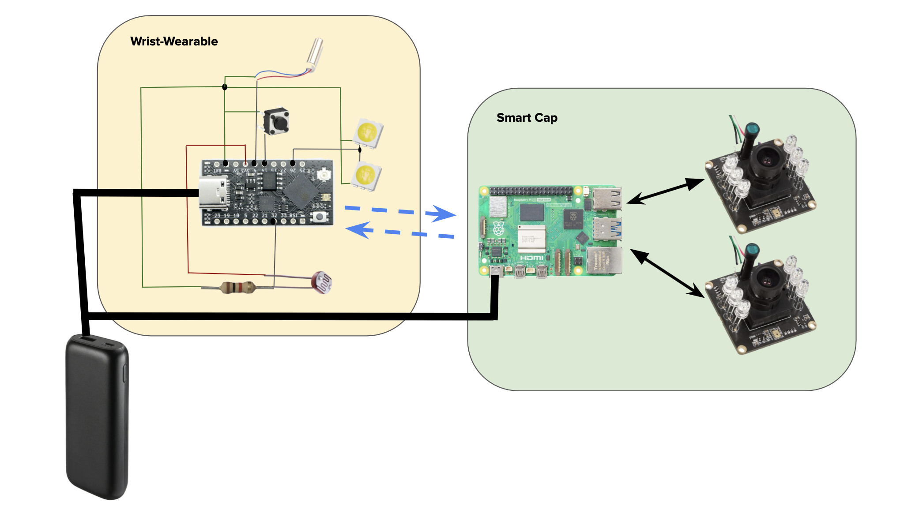

# Senior-Design-Smart-Bears
Smart System for the Visually Impaired

## Object Detection
- Installed YOLO3 Pretrained Model at: https://drive.google.com/drive/folders/1pNXnpgZHgF3hK5u3A770oh0gySt66psH?usp=sharing
  - Be sure to inclue the YOLO3 model in the same directory as the object detection script

## Network
- We are currently using a router to connect to the Raspberry Pi Zero and the Tiny Pico.
  - SSID: `smartbears`
  - Password: ` `

## Raspberry Pi

We are using RealVNC Viewer to view the Raspberry Pi Desktop. To do so, first connect to the Pi at `192.168.1.141`
- user: `pi`
- password: `smartbears`


### Bluetooth

We have set up a bluetooth device to enable microphone input and speaker output.

To set up bluetooth with our device, run `sudo bluetoothctl` to start the bluetooth control tool.

Find your device and its respective address. Then, pair and trust the bluetooth device:

```
pair 41:42:D4:02:07:00
trust 41:42:D4:02:07:00
```

You can now exit bluetoothctl with `exit`. You only need to do this once.

Run this command any time you want to reconnect the headset:
```
bluetoothctl connect 41:42:D4:02:07:00
```



